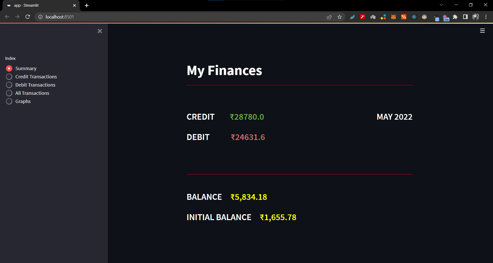

# Personal Finance

Analyse your monthly spendings💲

## Requiements 
 `.csv` file containing list of transactions

## Usage

```bash
git clone git@github.com:nkilm/personal-finance.git
```
```bash
cd ./personal-finance 
```
```bash
pip install -r ./requirements.txt
```
```
streamlit run app.py
```

#### NOTE : I have used the .csv file generated by `State Bank of India`

## Visuals
